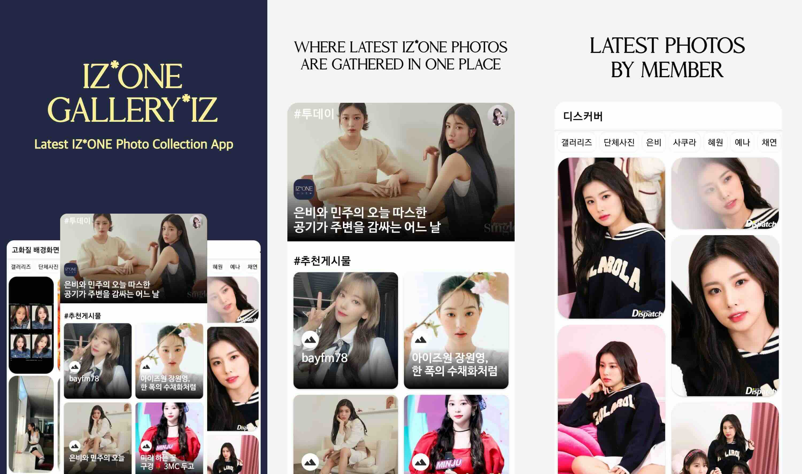
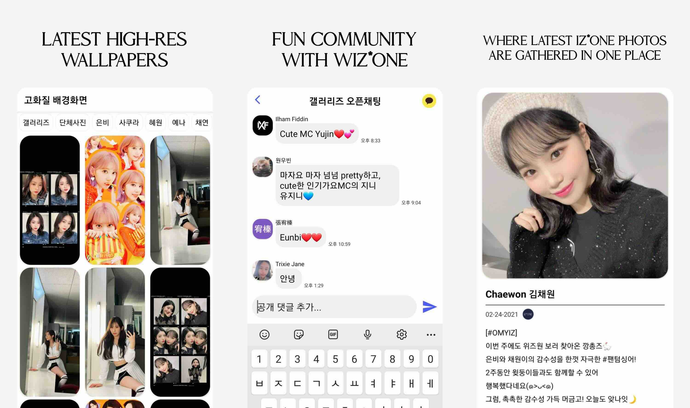

# IZONE GALLERY*IZ Android App

IZONE GALLERY*IZ is an Android application designed for fans of the K-Pop group IZONE, offering a platform to explore and share the latest photos and content related to the group.

Legacy release available on [Google Play](https://play.google.com/store/apps/details?id=com.yolastudio.bilog)



## Features

- **Photo Exploration**: Users can browse a regularly updated collection of IZONE photos, ensuring access to the latest images of the group.
- **User Authentication**: Secure login and account management are facilitated through Firebase Authentication.​
- **Realtime Database**: Utilizes Firebase Realtime Database to manage post-related data—such as images, likes, and comments—and support live group chat functionality.
- **Cloud Storage**: Leverages Firebase Cloud Storage for efficient management and delivery of media content.​
- **Push Notifications**: Keeps users informed about new content and updates via Firebase Cloud Messaging.

## Technologies Used

- **Java**: The primary programming language for Android development in this project.
- **Firebase Services**:
  - Authentication
  - Realtime Database
  - Cloud Storage
  - Cloud Messaging
 
## Achievements
- Improved push notification click-through rate by analyzing user engagement patterns and optimizing send times.
- Over 15,000 K-Pop fans from 180+ countries have joined IZONE GALLERY*IZ.
- Rated 4.8 from 700+ user reviews.



## Getting Started

To explore the application:
1. **Clone the Repository**:

    ```bash
    git clone https://github.com/danielkim-im/izonegalleryiz.git
    ```

2. **Open in Android Studio**:
Navigate to the project directory and open it using Android Studio.
3. **Build and Run**:
Ensure all dependencies are resolved and run the application on an emulator or physical device.

## Contact

For more information, visit the project's website.

## License

This project is licensed under the MIT License - see the [LICENSE](LICENSE) file for details.

_Note: IZONE GALLERYIZ is an independent project and is not affiliated with the official IZONE group.*_
